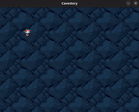

# CaveStory-cpp

==**A Remake of the game CaveStory using SDL2 in C++**==

## List of additions
   - Full .fx shader support {Probably gonna make for my next project and transfer here (YAHOO!)}
   - Lua Support {Probably gonna make for my next project and transfer here (YAHOO!)}

### Inspired in:
- Remaking CaveStory in C++ (https://youtu.be/ETvApbD5xRo)

## Progress so far:
